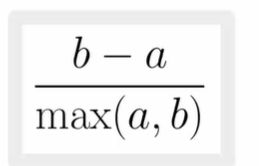
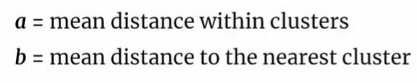

## Internal validation, what is the silhoette coefficient

<b>Reveal answer</b>

A way of measuring how 'good' the clustering is. Calculate it for all individual points, average over all points.    Best case: a is small, b is big Worst case: a is big, b is small  Best value = 1, close inside, far from others Worst value = -1, closer to the wrong cluster than your own!      

