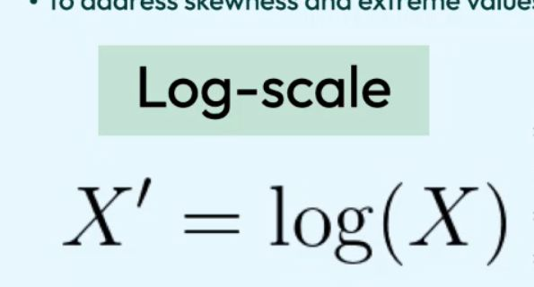

## explain log transformation and its use case

<b>Reveal answer</b>

To address skewness and extreme values, we can log&nbsp; X' = log(X)  Good for features that vary over orders of magnitude, or when you care more about ratios than differences

