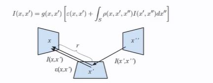

## Compared to path tracing, whats the limitation (and benefit!) of ray tracing, in terms of the way the it approximates the integral below 

<b>Reveal answer</b>

Ray tray tracing approximates by the summation of the contribution of 3 terms (at most) - Speculart reflection - refraction - diffuse (non recursive)  Only considers 3 terms... Benefit: Ignores the complex global illumination - computationally simpler, more performant.

