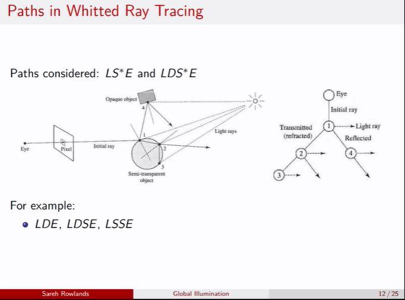

## Why dont we consider LSDE (or anytime D after S or before eye, or LDDE?)

<b>Reveal answer</b>

 Diffuse is only allowed when it’s the first surface after light, and nothing else diffuse can follow.

