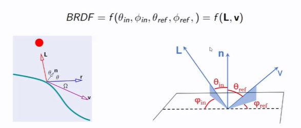

## What is the idea behind smart decisions in path tracing

<b>Reveal answer</b>

Do more random samples at important regions Use local illumination model to decide on important directions  e.g.  

