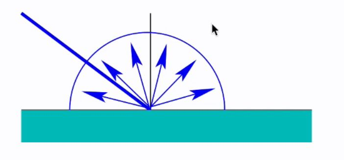
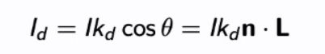
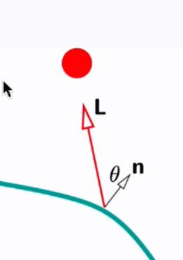

## Formula to calculate diffuse relfection&nbsp;

<b>Reveal answer</b>

  Id = I*kd*costheta = I*kd*dot(n,L)   I: intensity of incident light L: direction to light, L = normalise(plight - ppoint) (unit vector) n: surface normal (unit vector) kd: diffuse reflection coefficient  

