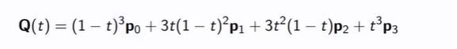

## Cubic Bezier curve formula

<b>Reveal answer</b>

  Q(t) = B0p0 + B1p1 + B2p2 + B3p3  B0 = (1-t)^3 B1 = 3 * (1 -t)^2 * t B2 = 3 * (1 - t) * t^2 B3 = t^3  Q(t) = (1-t)^3p0 + 3 * (1-t)^2 * t * p1 + 3 * (1 - t) * t^2 * p2 + t^3p3 

