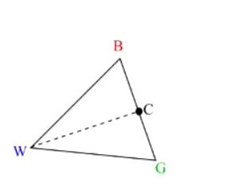

## 2 steps to find centroid of a simplex

<b>Reveal answer</b>

1. label coordinates with best, good, and worst function values: <b>f(B) &lt;= f(G) &lt;= f(W)</b>  2. Find the Centroid C of the best (B) and good vertex G: <b>C = 1/D * (B + G)</b>  D is the dimensions

