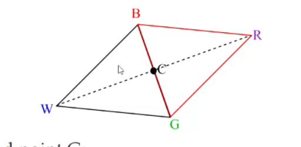

## What is reflection in downhill simplex

<b>Reveal answer</b>

Reflect the worst vertex W thorugh the centroid C of the best side  R = C + a(C-W) where a is usually 1, or &gt; 0   We accept R if&nbsp; f(R) &lt; f(G), ie R is better

