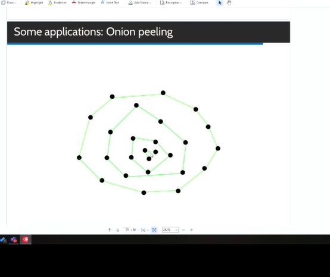

## Applications of Convex Hull

<b>Reveal answer</b>

- Sports territory coverage - Animal Habitat, onion peeling&nbsp;&nbsp;likelyhood of habitat decreases with each layer  - Occlusion of videogame game objects / rendering

