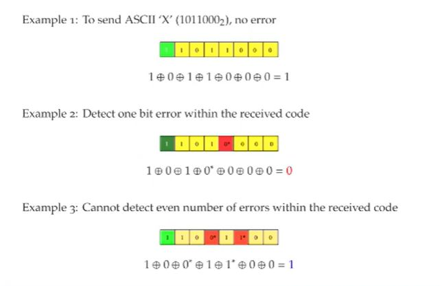

## Parity check explained

<b>Reveal answer</b>

Parity check is XORing all the points together to see if they are even or odd.  Goal is to make the parity bit be 'even' or 'odd' depending on what the bits are.  

