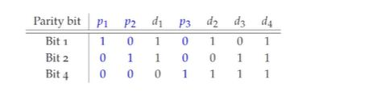

## What is the parity check matrix, when is it used?

<b>Reveal answer</b>

  you can also think of bit 1, bit 2, and bit 4, as p1, p2, p3 (as these do the parity checks FROM those positions)  used at the receiver

