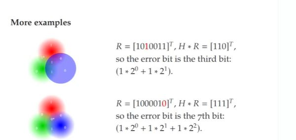

## Which bit is wrong? H is the parity check matrix, R is the receieved result. For the following two:  R = 1010011 H*R = [110]^T  R = [1000010] H*R = [111]^T

<b>Reveal answer</b>

3rd and 7th   IT GOES FROM LEFT TO RIGHT!

