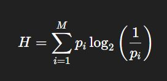

## Why is entropy&nbsp;useful in compression

<b>Reveal answer</b>

It's the theoretical lower limit on how many bits you need, on average, to represent each symbol.  You can't compress data below its entropy (on average) without losing information!

