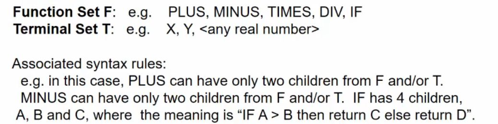

## Algorithm for generating a random program using:&nbsp;

<b>Reveal answer</b>

Define a max depth Initialise a random member of F for the root - set depth 1 Reapeat: - Choose function node X which does not have children - If depth of node is &lt; max depth - 1: &nbsp; &nbsp; - Randomly select appropriate child (from T or F) and set their depth to parent depth + 1 - If depth of node is max depth - 1: &nbsp; &nbsp; - Randomly select child from T

