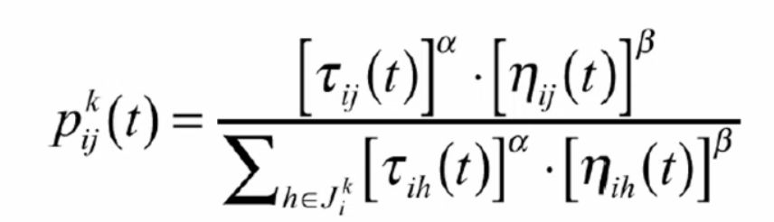

## if alpha / beta are small, what effect happens&nbsp;

<b>Reveal answer</b>

if alpha small, closest cities favoured - greedy algorithm  if beta is small, only pheromone +ve feedback - non optimal

