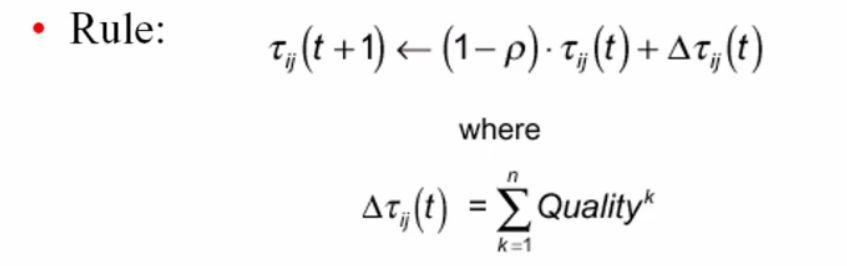

## explain update rule in plain english:&nbsp;

<b>Reveal answer</b>

The amount of pheromone at edge ij at time t + 1, is 1 - evvaporation rate * the amount of pheromone before + the amount of pheromone that has been deposited by all ants

