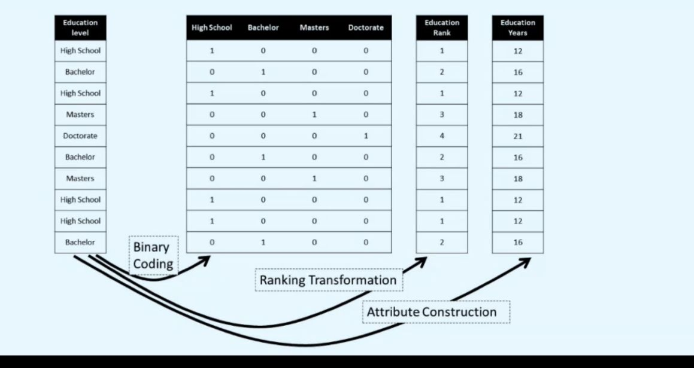

## Data transformation cat-&gt;num, 3 ways

<b>Reveal answer</b>

Sometimes we want to go from categories to numbers. - binary coding (ie if category true, place 1 in new column) - ranking transformation - attribute construction 

