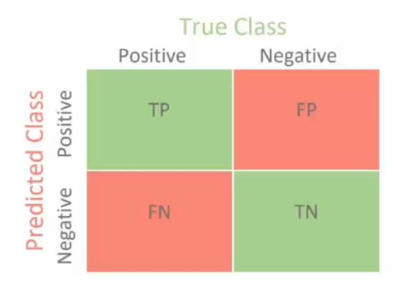

## In classification: classification rate/accuracy classification error precision recall 

<b>Reveal answer</b>

classification rate/accuracy is = [TP + TN] / [TP + TN + FP + FN] Classifcation error = 1 - classification rate Precision = TP / (TP + FP) Recall = TP / (TP + FN)

