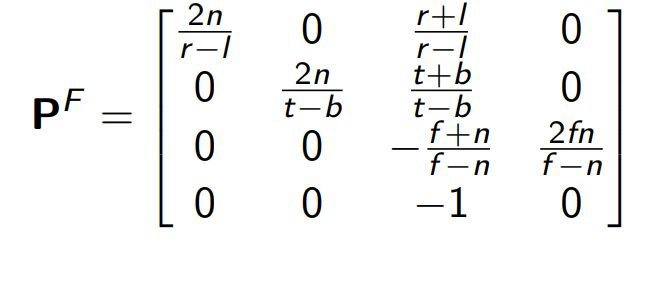

## Frustrum Projection transformation matrix

<b>Reveal answer</b>

  n = near clipping distance f - far clipping distance l - left clipping plane r - right clipping plane t - top clipping plane b - bottom clipping plane

