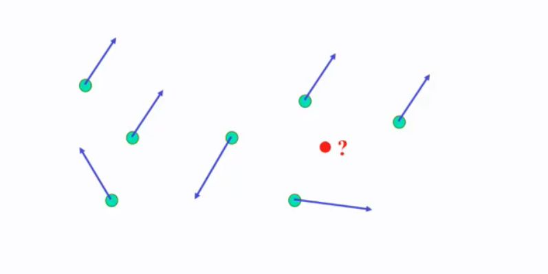

## What is non-rigid transformation (piecewise affine)

<b>Reveal answer</b>

Have a field of control points, each with a displacement vector.   move the point according to the distance to each point

