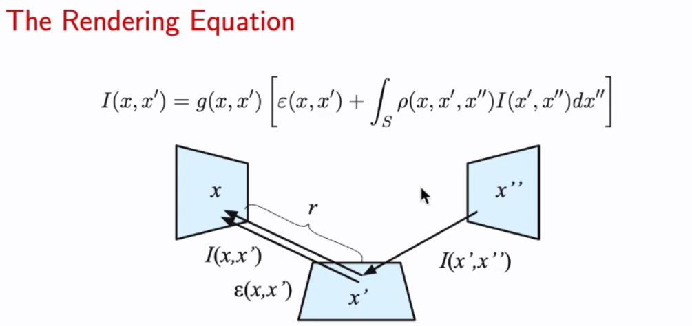
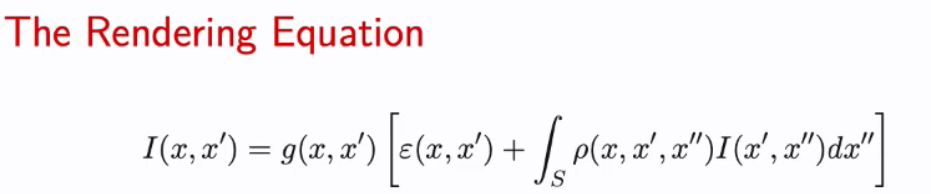
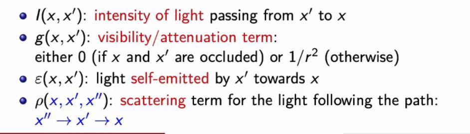

## &nbsp;Explain the params of this equation&nbsp;

<b>Reveal answer</b>

  I(x,x'): intensity of light from x' to x g(x,x'): attenuation term: 0 if x and x' are occluded, or 1/r^2 otherwise e(x,x'): light self emitted by x' towards x p(x,x',x''): scattering term for light following path x'' -&gt; x' -&gt; x&nbsp;

