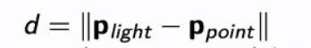

## How do we calculate the reflected direction in specular reflection

<b>Reveal answer</b>

r = 2 * dot(n,L) * n - L   where r is the direction n is the surface normal L is direction to light&nbsp; - d is distance to light,&nbsp; 

