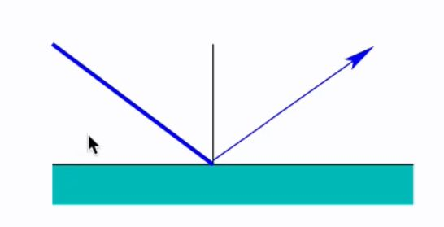
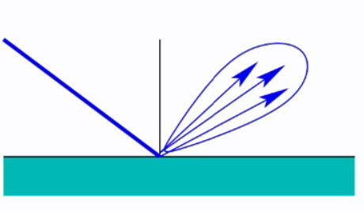

## Perfect specular reflection vs imperfect

<b>Reveal answer</b>

perfect: - reflection from a perfect mirror - incident and reflected light equal and opposite angles with surface normal   imperfect: - light scattered away from principal reflected direction 

