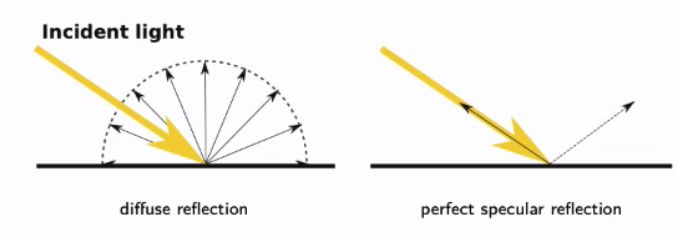

## What 4 things can happen when a ray of light hits a surface

<b>Reveal answer</b>

1. absorption (no re emission of light) 2. reflection - diffuse and specular&nbsp; 3. Refraction 4. Fluorescence (normally ignored in comp graphics)

