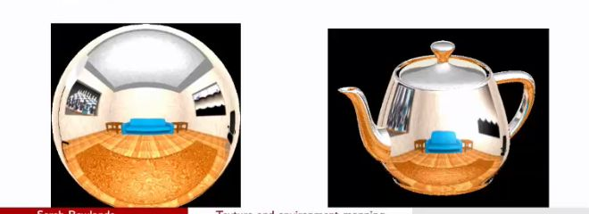

## Issues with sphere mapping (environment mapping)

<b>Reveal answer</b>

- inadequate resolution of texels near boundaries of causes distortions (mapping pixels to a sphere has inherent lack of resolution near poles)  

