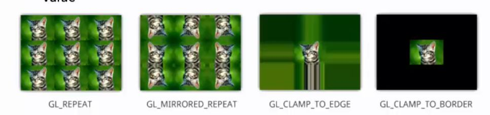

## OpenGL What happens when texture coordinates outside of 0,1 are given? Four options:

<b>Reveal answer</b>

GL_REPEAT: Pattern is repeated periodically GL_MIRRORED_REPEAT: Texture is flipped in alternance GL_CLAMP_TO_EDGE: Coord is clamped to 0,1 GL_CLAMP_TO_BORDER: Anything outside of 0,1 set to a default value  

