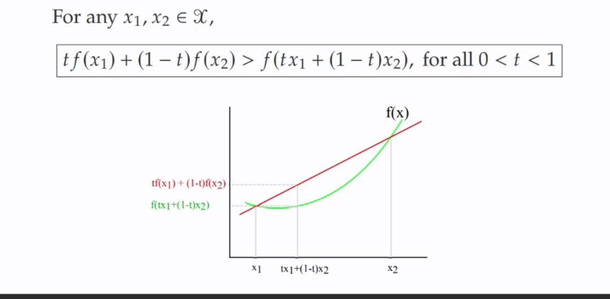

## What is jensen's inequality, and how does it relate to convex functions?

<b>Reveal answer</b>

Jensen's inequality: The secant line lies above the graph f(x) for any x1,x2 belonging to X  tf(x1) + (1-t)f(x2) &gt; f(tx1 + (1-t)x2) for all 0&lt;t&lt;1    (- Only has one minimum!)

