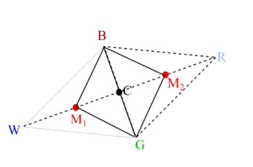

## If f(R) &gt;= f(G) (ie R is worse), then what do we do in downhill simplex?

<b>Reveal answer</b>

Contraction. Create two new points for consideration  <b>M1, M2 = C +- k(C - W)</b> Where k usually 1/2, 0 &lt; k &lt; 1 We then consider M1 and M2 is new potential points. Accept M1 if f(M1) &lt; f(W) and f(M1) &lt; f(M2) Accept M2 if f(M2) &lt; f(W) and f(M2) &lt; f(M1)

