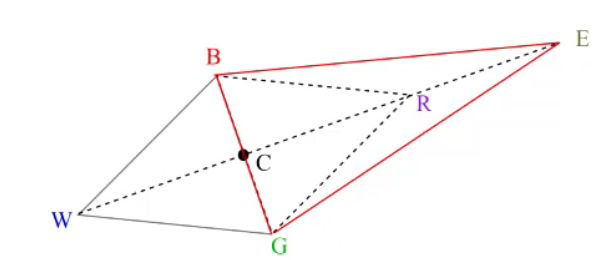

## If f(R) &lt; f(B) as a result of reflection, what can we do next? What's the intuition

<b>Reveal answer</b>

Expansion.  E = C + y(C-W) where y &gt; 1 and usually y = 2   Intuation: R gives a better value than B, then maybe that direction is just better.

