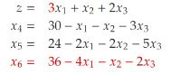
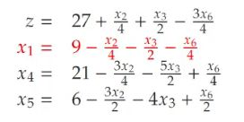

## Can you pivot on&nbsp;. Why do we choose x1 as pivot? Why x6 as the leaving variable.&nbsp;  (only care about making x1&nbsp; basic)

<b>Reveal answer</b>

Choose x1 as it has the biggest effect on z.  We choose x6, as it has the tightest constraint  therfore, we can define x1 as  The other values simply sub x1 in.

