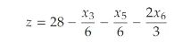

## simplex steps given a set of linear equations

<b>Reveal answer</b>

1. convert to slack form 2. check if basic solution exists (infeasible if it does not) 3. Pivot. Reformulate linear program so basic solution has a greater objective value. - Choose entering variable - Choose exiting variable 4. Iterate 5. Terminate when all coeffecients of the objective function are negative  28 is optimal

